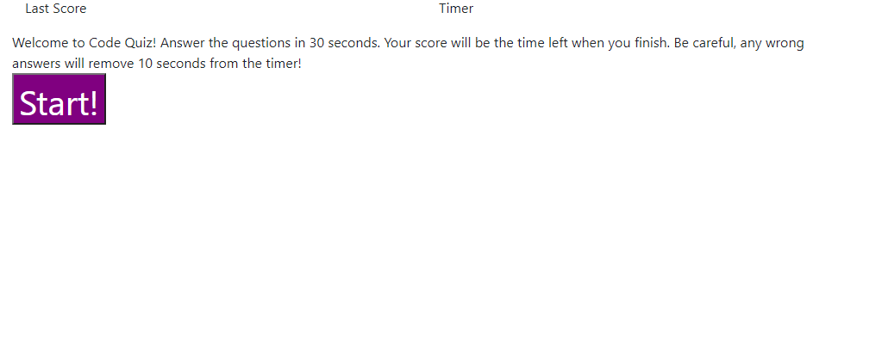
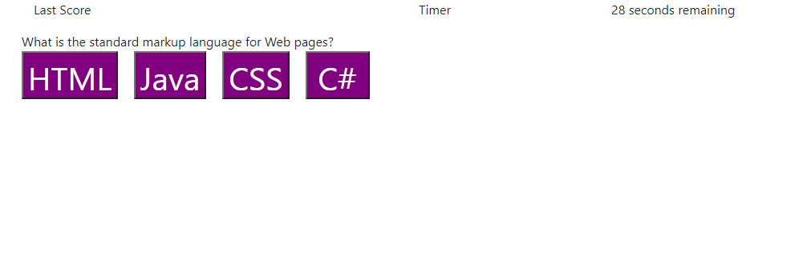

# mag-code-quiz

<h1>Mark Gire's Code Quiz</h1>

 This application will allow the user to begin a 4 question coding assessment. When the user selects the 'Start' button, the timer will start at 30 seconds. The user will then go through 4 multiple choice questions, clicking the 'Answer' buttons to submit their answer. Incorrect questions will subtract 10 seconds from the timer. Once the user completes the assessment, the final screen will show the user how many questions were answered correctly and their 'Score' which is the timeleft when answering the final question. This score will be stored in the 'Last Score' section. The user can then select "Play Again" to return to the main screen and play again. 

<h3> Known Issues </h3>
<ul> There is an issue where when the "Play Again" button is clicked, the timer does not restart </ul>
<ul> There is an issues where when the user plays again, the number of correct answers is not reset </ul>
<ul> There is currently no logic in place for users to input their initials to save their high score </ul>

 
 

 Author: Mark Gire 
